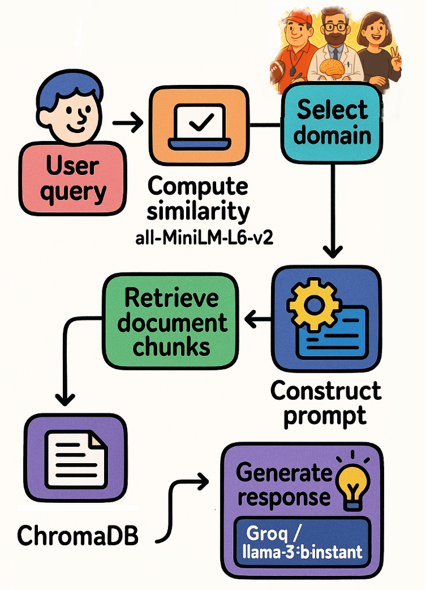

# AI Research Assistant With RAG and Modular Prompts
ReadyTensor Agentic AI Developer Certification Program - Module 1

# Abstract
Performing AI research alone can be difficult, confusing and sometimes frustrating. This project aims to provide an entertaining and helpful solution for performing AI research with a chat assistant that has various fun and unique personalities depending on the AI research topics being discussed. This project implements a modular Retrieval-Augmented Generation (RAG) assistant that dynamically selects relevant publications and specialized prompts based on semantic similarity of the user's query via HuggingFace embedding model, "all-MiniLM-L6-v2." Prompts with 3 focused domains were designed to assist the user with **AI research focused on the publications in the dataset related to football analytics, neuroscience, and sign language recognition.** The assistant integrates ChromaDB for vector storage, LangChain for LLM orchestration, and Groq-hosted LLaMA 3.1 for a fast inference large language model (LLM). The prompts emphasize structure and constraint enforcement to ensure domain-specific, safety-aligned responses.

<p align="center">
  
</p>

# 1. Introduction
The rise of domain-specific AI research requires intelligent assistants capable of retrieving and contextualizing relevant publications. This assistant addresses that need by combining modular prompt engineering with vector similarity search, ensuring responses are accurate, scoped, and stylistically aligned with the user’s intent and the associated research domain.

# 2. Dataset

Datasets stored in the "data" directory were converted manually to markdown format containing AI research publications related to football, neuroscience and sign language:
<br><br>**football_analytics.md** - "Football Analytics" by Barnik Chakraborty, 2025.
<br>A brief AI research publication that discusses football analysis using computer vision and machine learning.
<br>[(resource link)](https://app.readytensor.ai/publications/football-analytics-E10sJqzRdhuM)
<br><br>**neuro_persona.md** - "NeuroPersona: Simulation of Dynamic Cognitive Perspectives"  by Ralf KruMmel, 2025.
<br>A moderately sized AI research publication that discusses a simulation platform, "NeuroPersona," that can replicate human cognition and emotion.
<br>[(resource link)](https://app.readytensor.ai/publications/neuropersona-A9Nex0aLF2Lp)
<br><br>**sign_language_recognition.md** - "American SIgn Language Recognition to Speech System for Medical Communication"
<br>by Haziqa Sajid and Asad Iqbal, 2024.
<br>A highly detailed report with many code examples that uses computer vision and machine learning to recognize the American Sign Language (ASL) alphabet.
<br>[(resource link)](https://app.readytensor.ai/publications/american-sign-language-recognition-to-speech-system-for-medical-communication-w59iywWFcsst)

# 3. Methodology
The system employs SentenceTransformer embeddings to index and search markdown-based research documents. A user query is embedded and compared with predefined topic categories to select a matching prompt template. Retrieved chunks split by format headers, based on the relevant documents are then passed, along with the query, into a structured prompt to the LLM. The pipeline leverages OpenAI embeddings for document encoding and LangChain's Groq integration for real-time generation.


## Overview

```
modular-rag-assistant/
├── .env                   # Stores sensitive environment variables (API keys). Not committed to Git.
├── .env.example           # Provides a template for the .env file, showing required variables. Committed to Git.
├── .gitignore             # Specifies intentionally untracked files and directories that Git should ignore.
├── code/                  # Contains all Python source code for the application.
│   ├── config/            # Configuration files for the application.
│   │   ├── config.yaml          # Main application settings, including models and parameters.
│   │   └── prompt_config.yaml   # Defines the various modular prompts.
│   ├── paths.py           # Defines directory and file paths for the project.
│   ├── utils.py           # Handles data, text chunking, embeddings and interactions with vector database.
│   ├── llm_service.py     # Manages communication with the Language Model API, including retrieval and response generation.
│   ├── main.py            # Handles UTF-8, main logger, environment, main loop with prompt by similarity.
│   └── prompts.py         # Loads environment, initialize LLM, builds prompt.
├── data/                  # Directory for AI research publications in markdown format.
│   ├── football_analytics.md  # Data file for football analytics
│   ├── neuro_persona.md       # Data file for neuro persona research
│   └── sign_language_recognition.md # Data file for sign language recognition
├── README_images/                # Stores images for the README.
├── models/                # Directory to store any local machine learning models.
│   └── .gitkeep           # Directory placeholder file for Git tracking.
├── output/                # Main output folder for generated files and persistent data.
│   └── vector_db/         # Subfolder to store the local vector database index and associated data.
├── requirements.txt       # Lists all Python package dependencies required to run the project.
└── README.md              # Provides a general project report, setup instructions, and usage guidelines for the project.
```

## Installation

> [!WARNING]
> To showcase LLM responses with a fun personality, prompt responses contain emojis in UTF-8 format. For the best viewing experience, make sure your terminal or display environment supports **UTF-8 encoding**. If not, emojis might appear as broken characters.

1. **Clone the repository:**

   ```bash
   git clone https://github.com/caliskate/modular-rag-assistant.git
   cd modular-rag-assistant
   ```

2. **Install dependencies:**

   ```bash
   pip install -r requirements.txt
   ```

3. **Set up Groq API key:**

   Create an `.env` file into root directory and add your API key:

   ```
   GROQ_API_KEY=your-api-key-here
   ```

   You can get your API key from [Groq](https://console.groq.com/).

# 4. How it Works
The assistant operates through a streamlined pipeline designed for efficient and context-aware information retrieval. When a user submits a query, the first step involves computing its semantic similarity against a set of predefined domain-specific topics. This is achieved using the "all-MiniLM-L6-v2" model from Hugging Face's Sentence Transformers, which is highly efficient at generating dense vector embeddings for short texts. The topic with the highest similarity score determines the most appropriate domain (e.g., football, neuroscience, or sign language) and, consequently, the relevant modular prompt template to be used for the large language model (LLM).

Next, the system leverages this understanding to retrieve pertinent information. The user's query is used to perform a vector similarity search against a ChromaDB vector store, which houses pre-indexed chunks of research publications. These publications are split into chunks of text by a chunk_publication utility, which splits markdown content based on header levels (like #, ##, ###). This intelligent chunking ensures that each segment maintains contextual integrity by preserving the header within its associated content, making the retrieved information more coherent for the LLM. Furthermore, the chunking function includes logic to merge smaller chunks that fall below a min_chunk_size into preceding chunks, preventing the LLM from receiving fragmented or incomplete information.

Once the relevant document chunks are retrieved, they are integrated into a dynamically constructed prompt. This is where modular prompt engineering, facilitated by the build_prompt_from_config function, comes into play. LangChain is employed to orchestrate this entire process, acting as a flexible framework that seamlessly connects the various components: from embedding generation and vector store interaction to prompt construction and LLM inference. Specifically, LangChain's capabilities are utilized for managing the conversational flow and simplifying the interaction with the Groq API. The retrieved document chunks, along with the user's original query and the selected domain-specific prompt template, form a comprehensive input for the LLM. Finally, the constructed prompt is sent to the Groq LLaMA model (llama-3.1-8b-instant), chosen for its real-time generation capabilities, to produce an accurate, contextualized, and stylistically aligned response, which is then delivered to the user.

<p align="center">
  
</p>

## Usage

### Modular prompt chat assistant

- **`python code/main.py`**

This launches the assistant in your terminal or command-line interface. An interface that supports UTF-8 emojis is reccomended.
You’ll be prompted to enter a question about football, neuroscience, or sign language AI research, or type config or exit.


# 5. Key Features
Modular prompt selection via query-topic similarity.

Document-grounded responses using ChromaDB vector search.

Domain enforcement through strict output constraints in prompt configuration.

Stylistic customization such as markdown formatted responses, domain-specific language (e.g., football coach style speach or neurology lab noises, sign language gestures and emoji themed responses with a personified assistant introduction: 🏈,🧠,✌️).

High-speed inference powered by Groq-hosted LLaMA 3.1 models.

A fallback prompt will redirect the user to which topics can be discussed.

Responses are designed to strictly discuss information from each topic's publication.


# 6. Usage Examples

## Asking About Football:
  
   
**User :**
   ```
 what can you tell me about football?
   ```
**LLM response:** 
   ```
**Hello there, I'm Coach Thompson from Oakdale High School in Oakdale, California.**

I'd be more than happy to share some information about football from the perspective of Football Analytics.

According to the publication, football is a contact team sport played between two teams of 11 players using an oval-shaped ball with pointed ends.

Some key concepts in Football Analytics include:

* **Game Scripting**: this is a predictive model used to forecast game outcomes based on historical data and team performance.
* **Expected Possession Value (EPV)**: this is a metric used to evaluate the expected points a team can score from a given situation.
* **Passer Rating**: this is a metric used to evaluate a quarterback's performance based on completion percentage, yards per attempt, touchdowns, interceptions, and fumbles lost.

Football is a game of strategy, skill, and physicality. It requires a deep understanding of the game and its intricacies.

(blowing whistle sound)

If you have any specific questions about football or Football Analytics, I'd be happy to help.

🏈

**'Tackle the day, and may the odds be ever in your favor!'**
   ```

## Asking About Neuroscience:

   
**User:**
   ```
what can you tell me about neuroscience?
   ```
**LLM response:** 
   ```
Nice to meet you, I'm Dr. Emma Taylor, a neuroscientist with 10 years of experience in the field 🧠.

As a neuroscientist, I'd be happy to provide you with an overview of the field of neuroscience. However, I must clarify that my responses will be strictly based on the provided publication.

Here's a brief overview of neuroscience:

**What is Neuroscience?** (loud laboratory noises)
Neuroscience is the study of the structure and function of the nervous system, which includes the brain, spinal cord, and nerves.

**Branches of Neuroscience:**

* Behavioral Neuroscience: studies the relationship between the brain and behavior
* Cognitive Neuroscience: studies the neural basis of cognition, including perception, attention, memory, and language
* Clinical Neuroscience: studies the diagnosis and treatment of neurological and psychiatric disorders
* Developmental Neuroscience: studies the development and maturation of the nervous system
* Neuroanatomy: studies the structure and organization of the nervous system
* Neurophysiology: studies the function and regulation of the nervous system

**Applications of Neuroscience:**

* Understanding neurological and psychiatric disorders, such as Alzheimer's disease, Parkinson's disease, and depression
* Developing new treatments and therapies for these disorders
* Improving cognitive function and memory
* Enhancing brain-computer interfaces and neuroprosthetics
* Understanding the neural basis of consciousness and intelligence

I'm happy to answer any specific questions you may have related to neuroscience, based on the provided publication.

Please feel free to ask your next question! 🧠
   ```

## Asking About Sign Language:

**User:** 
   ```
what can you tell me about sign language?
   ```
**LLM response:** 
   ```
**Hello, I'm Dr. Rachel Gardner, a researcher at the University of California, Berkeley, specializing in Sign Language Recognition.**

Given the provided documents, here's what I can tell you about Sign Language:

* **Overview**: Sign Language is a visual language used by Deaf and hard-of-hearing communities to communicate.
* **Types**: There are several types of Sign Languages, including American Sign Language (ASL), British Sign Language (BSL), and Langue des Signes Québécoise (LSQ).
* **Recognition**: Sign Language Recognition involves the use of computer vision and machine learning algorithms to recognize and interpret sign language gestures.
* **Applications**: Sign Language Recognition has various applications, including:
        + Communication aids for Deaf and hard-of-hearing individuals
        + Video conferencing and remote communication systems
        + Sign language learning tools and educational resources
* **Challenges**: Some challenges associated with Sign Language Recognition include:
        + Variability in sign language gestures and handshapes
        + Limited training data and domain awareness
        + Difficulty in handling complex sign language expressions and context-dependent meanings

**✌️**
As I conclude, I make the "stop" gesture with my hand, signaling that our conversation has come to an end.
   ```

## Asking About Irrelevant Information Within an Available Topic:


**User:**
   ```
 tell me about football parties
   ```
**LLM response:**
   ```
 I'm not able to answer that as the topic of football parties is not within my scope (football and its related activities, neuroscience, sign language AI research).
   ```

# 7. Project Limitations
The prompts for the chat assistants are intentionally limited to speaking about their related publications, but without a substantial variety in the publication data for each topic, the user engagement may only be short term when continously attempting to discuss information that is not listed in the publication data. A project like this may require less constraints for the chat assistant to maintain functionality and user engagement with limited data. The publications are also only limited to markdown format, so any publications must be converted to this format for the application. For new topics introduced into the publication data, a new prompt must also be created to have another personality capable of discussing a different AI research industry other than football, neuroscience or sign language. It may be more efficient to update this project to have one dynamic prompt that is automatically personalized to any topic introduced into the publication data, since most of the prompt guidelines are similar with only minor personality changes to each topic's prompt. Certain interfaces may also not be compatible with the emojis used in the prompt responses.

# 8. Conclusion
This modular RAG assistant demonstrates how controlled, prompt-based architectures can guide general-purpose LLMs to deliver reliable, focused, and engaging outputs in specialized domains. With extensible design and safety constraints embedded in the prompting layer, it serves as a robust foundation for future research in domain-aware RAG chat assistants.

# 9. Contact
Feel free to reach me via email (dverduzco@sandiego.edu) or Discord (d_verduzco)


## License

This project is licensed under the [MIT License](LICENSE).
